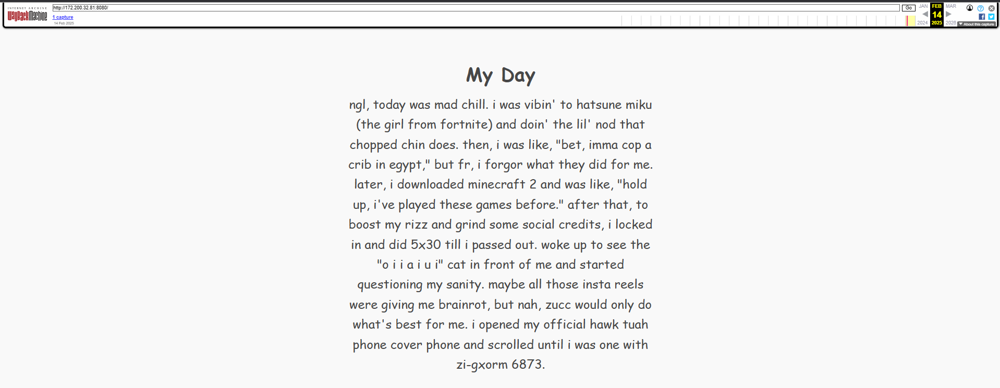
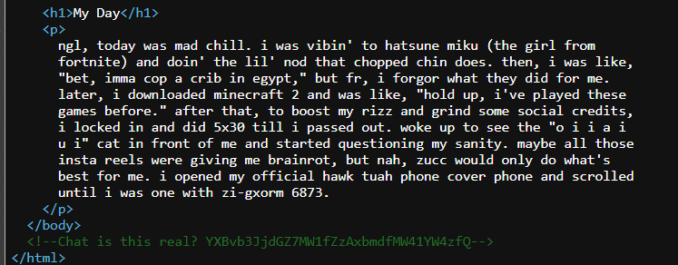

## Challenge Overview

The challenge provided a PCAP file and a hint mentioning a blog. The goal was to extract useful information from the network traffic and find the flag.

this challenge was a mix of forensics and osint , it was creative and fun to solve .

## Step 1: Inspecting the PCAP File

Upon opening the PCAP file in Wireshark, I noticed that there was only one HTTP request. Since the challenge mentioned a blog, I suspected this HTTP traffic might be relevant.

## Step 2: Finding an IP Address

Scrolling through the packets, I found an IP address along with a port number:

```
172.200.32.81:8080
```

I attempted to access it, but it was not reachable. This meant I needed to look deeper into the PCAP file for more clues.

## Step 3: Extracting Hidden Data

To analyze the entire content of the packets, I ran the `<span>strings</span>` command on the PCAP file. This revealed a conversation between two users, `<span>hawk1</span>` and `<span>hawk2</span>`:

```
hawk2: hey there, how was ur valentines day
hawk1: It was fire, I wrote a blog on this 172 200 32 81 8080
GET / HTTP/1.1
Host: 172.200.32.81:8080
User-Agent: Mozilla/5.0
Accept: text/html
HTTP/1.1 200 OK
Content-Type: text/html
Content-Length: 250
<html></html>
hawk2: delete ts bro
hawk1: sed
```

The mention of "delete" in the conversation made me suspect that the blog was removed. This led me to check the **Wayback Machine**.

## Step 4: Using Wayback Machine

I searched for historical snapshots of `<span>http://172.200.32.81:8080</span>` on the Wayback Machine. I found a cached version of the blog, but it contained seemingly meaningless content.



## Step 5: Viewing the Source Code

Remembering that there was an HTML response in the PCAP data, I decided to inspect the source code of the archived page. Upon viewing the source, I found a hidden comment containing a Base64-encoded string.



## Step 6: Decoding the Base64 String

I copied the encoded string and decoded it using the following command:

```
echo "YXBvb3JjdGZ7MW1fZzAxbmdfMW41YW4zfQ" | base64 -d
```

This revealed the flag : apoorctf{1m_g01ng_1n5an3}
