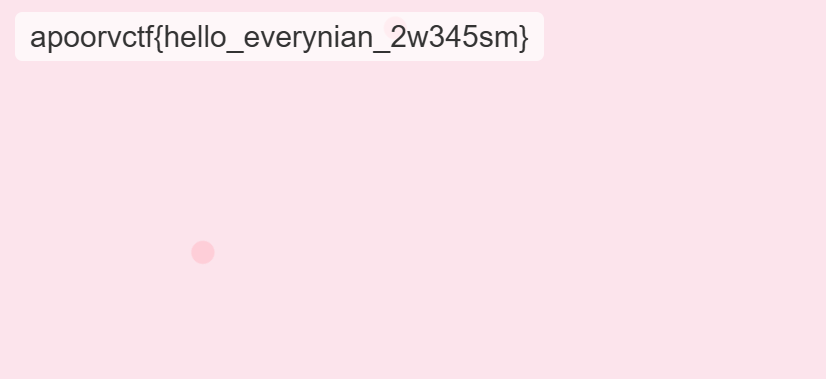

# Challenge Description

Hey everyone, I have a friend, Sakura. She wanted to learn how programming works, so I gave her the best advice anyone could have given her—participate in ApoorvCTF.

She's trying her best to find flags and could only find the welcome flag by sending `<span>/flag </span>`.

If you consider yourself real OSINTers—stalk her.

---

> so as you can see they challenged us to find sakura if we are real osinters , can we ?

## Step 1: Searching for Sakura in the apoorvctf Discord Server

The first step was to search for the name sakura in the CTF Discord server. they mentioned she was only able to solve the welcome challenge, which was solved using `<span>/flag</span>`. , and that was the case for the account ive found .after that i looked at the profile and it had a reddit account connected to it ,Her Reddit posts were mostly sarcastic opinions on various topics, but one post stood out.


---

## Step 2: Analyzing Her Reddit Post

In this post, she asked for help regarding a Python project:

> "What even is Reddit? My friend told me to ask my doubts here, but I don't know how. I'm just putting it here; if you know how to solve the problem, please answer.
>
> So, I was making this Python project called 'tasty sakura thing,' but my code is not running. It is giving some syntax error. I am new to all this. Please help."
>
> u/flaky_sakura - pls help with python code
>
> **Error here:**
> `<span>erorr(): try: response = requests.get(api_url)</span>`

The mention of "tasty sakura thing" hinted at a potential GitHub repository.

---

## Step 3: Searching on GitHub

Since GitHub is a common place to host programming projects, I searched for "tasty sakura thing" on GitHub. A project matching this name appeared in the results.

Checking the repos, I found a file named `<span>server.py</span>`, which contained the following code:

```
# python assignment 1
# request scoreboard data from ctf website
import requests
import json
from datetime import datetime

def fetch_ctf_data(url):
    try:
        response = requests.get(url)
        response.raise_for_status()
        return response.json()
    except requests.RequestException as e:
        print(f"Error fetching data: {e}")
        return None

def validate_flag(api_key):
    api_url = f"http://sakura.apoorvctf.xyz:5050/?apiKey={api_key}"
    try:
        response = requests.get(api_url)
        response.raise_for_status()
        flag_data = response.json()
        print("\n🔹 Flag Validation Result 🔹")
        print(json.dumps(flag_data, indent=4))
    except requests.RequestException as e:
        print(f"Error validating flag: {e}")

def main():
    api_url = 'https://apoorvctf.iiitkottayam.ac.in/api/v1/ctftime'
    ctf_data = fetch_ctf_data(api_url)
    validate_flag(api_key)

if __name__ == "__main__":
    main()
```

The script included a function `<span>validate_flag(api_key)</span>`, which made a request to `<span>http://sakura.apoorvctf.xyz:5050/</span>` using an API key.

---

## Step 4: Investigating the API URL

I accessed `<span>http://sakura.apoorvctf.xyz:5050/</span>` in a browser. The page displayed:

> "No API key provided."
>
> 

This indicated that an API key was required to retrieve the flag.

---

## Step 5: Finding the API Key

Returning to the GitHub repository, I searched through the commit history. Eventually, I found an API key in one of the commits:

> `<span>api_key = 92872d789c838a2bdc523a8de5e54749</span>`

Using this API key, I accessed:

> `<span>http://sakura.apoorvctf.xyz:5050/?apiKey=92872d789c838a2bdc523a8de5e54749</span>`

This returned the flag!

```
apoorvctf{hello_everynian_2w345sm}
```


